# 🧠 AttentiveHybridNet

### *Brain Tumor Classification using Hybrid Deep Learning*

---

## 🎯 Overview

AttentiveHybridNet is a state-of-the-art hybrid deep learning architecture that combines **ResNet-18** and **Swin Transformer** through a novel **cross-attention mechanism** for accurate brain tumor classification from MRI scans.

### 🌟 Key Highlights

✨ **Dual-Branch Architecture** - Captures both local spatial patterns and global context  
🎯 **Attention-Guided Fusion** - Intelligent feature integration  
🏆 **SOTA Performance** - Outperforms EfficientNetV2+ViT and CNN-SVM ensembles  
🔍 **Grad-CAM Visualization** - Interpretable decision-making  
✅ **Robust Validation** - 5-fold cross-validation with calibration analysis (ECE < 0.03)

---
## 📈 Ablation Study Results

| Model Configuration       | Accuracy | Precision | Recall | F1-Score | Improvement vs ResNet-18 |
|:--------------------------|:--------:|:---------:|:------:|:--------:|:------------------------:|
| ResNet-18 Only            | 87.11%  | 87.45%   | 87.12% | 87.05%  | -                        |
| Swin Transformer Only     | 94.88%  | 95.15%   | 94.88% | 94.85%  | +7.77%                   |
| Concatenation Fusion      | 94.25%  | 94.32%   | 94.27% | 93.92%  | +7.14%                   |
| **Cross-Attention (Ours)**| **96.37%** | **96.49%** | **96.37%** | **96.38%** | **+9.26% ⭐**          |

### 🔑 Key Insights

- 🌟 **Cross-Attention (Ours)** achieves **+9.26% improvement** over ResNet-18 baseline.  
- 💡 Outperforms simple **concatenation fusion by +2.12%**.  
- 🚀 Surpasses standalone **Swin Transformer by +1.49%**.  
- ✅ Maintains **consistent performance across all metrics (>96%)**.  

---

## 🔬 Methodology

---

## 📊 Dataset

**Brain Tumor MRI Dataset** ([Figshare](https://figshare.com/articles/dataset/brain_tumor_dataset/1512427))

- **Classes**: 3 (Glioma, Meningioma, Pituitary)
- **Image Size**: 224×224 pixels
- **Validation Strategy**: Stratified 5-Fold Cross-Validation

### Data Augmentation

```mermaid
graph LR
    A[Original MRI] --> B[Random Horizontal Flip]
    A --> C[Random Vertical Flip]
    A --> D[Random Rotation ±15°]
    A --> E[Color Jitter<br/>Brightness/Contrast/Saturation]
    A --> F[Random Affine Transform]
    
    B --> G[Augmented Dataset]
    C --> G
    D --> G
    E --> G
    F --> G
    
    style A fill:#ff6b6b,stroke:#fff,stroke-width:2px,color:#fff
    style G fill:#2ecc71,stroke:#fff,stroke-width:2px,color:#fff
```

---

## 🏆 Comparison with State-of-the-Art

| Study | Model | Accuracy |
|:------|:------|:--------:|
| Lu et al. (2025) | MIL + Contrastive Learning | 96.3% |
| Tariq et al. (2025) | EfficientNetV2 + ViT | 96.0% |
| Yoon (2025) | Xception + PDCNN | 94.85% |
| Remzan et al. (2024) | ResNet-50 Ensemble | 92.31% |
| Semwal et al. (2025) | CNN-SVM + PSO | 84.77% |
| **Our Work** | **ResNet18 + Swin + Cross-Attention** | **96.37%** ⭐ |

---

## 🎨 Model Interpretability

### Grad-CAM Visualization

Our model uses Gradient-weighted Class Activation Mapping (Grad-CAM) to highlight regions of interest in MRI scans:

✅ **Consistent attention** to tumor regions across all folds  
✅ **Semantic relevance** in decision-making  
✅ **Clinical interpretability** for medical professionals

---

## 📝 Implementation Details

| Component | Configuration |
|:----------|:--------------|
| **Framework** | PyTorch |
| **GPU** | NVIDIA Tesla T4 (16GB VRAM) |
| **Optimizer** | Adam |
| **Learning Rate** | 1e-5 (backbones), 1e-4 (fusion + classifier) |
| **LR Scheduler** | Cosine Annealing with Warm Restarts |
| **Batch Size** | 16 |
| **Early Stopping** | Patience = 10 epochs |
| **Loss Function** | Weighted Cross-Entropy |

---

## 👤 Author

### **Samiksha**

*Computer Science Engineering*  
*Thapar Institute of Engineering and Technology*

---

## 🙏 Acknowledgments

- **Dataset**: [Brain Tumor Dataset](https://figshare.com/articles/dataset/brain_tumor_dataset/1512427) by C. Jun
- **Infrastructure**: Google Colab Pro with NVIDIA Tesla T4 GPU
- **Pretrained Models**: PyTorch torchvision and timm libraries
- **Conference**: Paper accepted and presented at AISUMMIT 2025

---

### ⭐ Star this repository if you find it helpful!

**Made with ❤️ by Samiksha**

